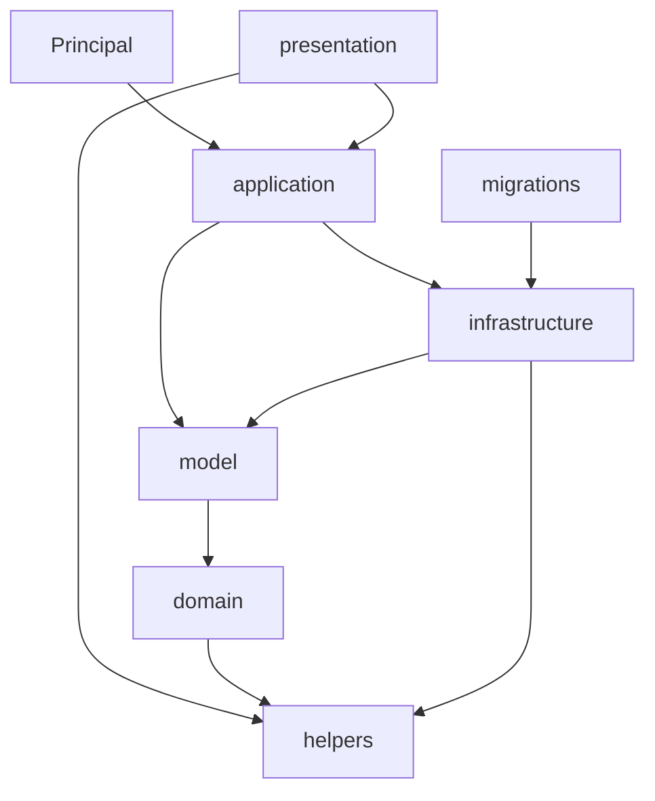

# Estrutura do projeto `redeancora_compra`


Guia de organização do código-fonte Data7 Basic e das responsabilidades de cada camada.


## Visão geral


```

src/

├── Principal.bas                 # Entrypoint do plugin

├── application/                  # Orquestração (services, bootstrap)

│   ├── services/

│   │   ├── usuario/              # usuario_service

│   │   └── rede_ancora/          # API B2B: auth, empresa, catálogo, produto, carrinho, checkout
│   │       └── dto/              # DTOs Input/Output dos contratos de serviço (4+ parâmetros)

│   └── bootstrap/                # run_migrations

├── domain/value_objects/         # Tipos de domínio com validação

├── infrastructure/

│   ├── database/                 # SQL, transações e repositórios

│   ├── events/                   # Listeners periódicos

│   └── http/                     # Cliente HTTP (API B2B)

├── presentation/                 # Camada de UI

│   ├── colors.bas                # Paleta e cores de tela

│   ├── forms/                    # Telas (.bas / .d7b) — pendente

│   └── components/               # Blocos visuais reutilizáveis — pendente

├── helpers/                      # Utilitários puros (sem dependência de model)

├── migrations/

│   ├── framework/                # Motor genérico de migrations

│   └── rede_ancora/              # rede_ancora_migration

└── model/

    ├── usuario/                  # Modelos: UsuarioModel, UsuariosModel

    ├── rede_ancora/              # Models B2B: auth, carrinho, checkout, produto, catálogo, …

    └── pesquisa_padrao/          # PesquisaPadraoModel

```


Pastas compartilhadas fora de `src/`:


| Pasta | Uso |

|-------|-----|

| `data7_modules/` | Módulos globais (`mod_tobject`, `mod_logger`, …) |

| `docs/` | Documentação funcional e de arquitetura |

| `data7.json` | Descritor do projeto (pastas virtuais + metadados) |


## Camadas e dependências





**Regras:**


- `helpers/` não importa `model/` nem `application/`

- `domain/` importa apenas `helpers/` e `mod_tobject`

- `model/` contém apenas objetos de domínio (models) — sem acesso a banco

- `infrastructure/database/` contém repositórios e SQL — importa `model/` e `helpers/`

- `application/` coordena repositórios (`infrastructure/`) e expõe casos de uso

- `presentation/` concentra UI; telas ficam em `presentation/forms/`


## Módulos por camada


### Application


#### `application/bootstrap/`


| Módulo | Responsabilidade |

|--------|------------------|

| `app_boot` | Boot do plugin: apenas migrations |
| `run_migrations` | Executa `RedeAncoraMigration` na inicialização |
| `rede_ancora_smoke_test` | Ping + profile (teste manual) |
| `rede_ancora_empresa_sync_test` | Sync profile → banco (teste manual) |
| `rede_ancora_produto_sync_bootstrap` | Sync produtos CNA/catálogo (teste manual) |
| `rede_ancora_checkout_bootstrap` | Fluxo carrinho + checkout (teste manual) |
| `rede_ancora_api_novos_bootstrap` | Sales, ScheduledOrder, Agenda, Haulers e produtos complementares (teste manual) |
| `rede_ancora_dev_harness` | Orquestrador de cenários de homologação |


#### `application/services/usuario/`


| Módulo | Responsabilidade |

|--------|------------------|

| `usuario_service` | Facade de casos de uso: usuário Data7 + toda a integração Rede Âncora (`UsuarioService`) |


#### `application/services/rede_ancora/`


| Módulo | Responsabilidade |
|--------|------------------|
| `rede_ancora_api_config` | URLs base (`/api/api/integration/v1`), staging, flags (log HTTP, validação produto) |
| `rede_ancora_http_client` | Monta `HttpClient` com header `X-API-KEY` |
| `rede_ancora_api_client` | HTTP autenticado: 401 exige chave válida, retry 429/500, log de corpos |
| `rede_ancora_json_helper` | Parsing seguro de JSON (tipos mistos da API) |
| `rede_ancora_url_helper` | URL encoding de query params (`full-search`, carrinho) |
| `rede_ancora_autenticacao_service` | Ping, gravação de chave API, sync usuário via profile |
| `rede_ancora_empresa_service` | `GET /profile`, bloqueio, permissões, CDs |
| `rede_ancora_modalidade_service` | `GET /modalities` + cache local |
| `rede_ancora_catalogo_service` | Marcas, linhas e famílias (`/products/brands`, …) |
| `rede_ancora_produto_service` | Consultas de produto, bulk-search, warehouses, vínculo CNA, sync de imagens; `GET /products`, similares, bulk, prices-stocks-warehouses |
| `rede_ancora_produto_sincronizacao_service` | Sync em lote de CNAs e catálogo completo |
| `rede_ancora_produto_sincronizacao_modo` | Constantes de modo de sync (`COMPLETA`, `NOVOS`) |
| `rede_ancora_carrinho_service` | Carrinho (`/checkout`, itens, bulk); `POST /sales/orders/{id}/reorder` |
| `rede_ancora_checkout_service` | Review, pagamentos, logística, `POST .../order`; CRUD de transportadores (`/logistics/haulers`) |
| `rede_ancora_sales_service` | Pedidos e pendências da API (`/sales/orders`, `/sales/pendencies`) — pass-through JSON |
| `rede_ancora_pedido_programado_service` | Pedidos programados (`/scheduled-order`) — pass-through JSON |
| `rede_ancora_agenda_compras_service` | Agenda de compras (`GET /sale-offers/brands`) — pass-through JSON |
| `rede_ancora_produto_vinculo_origem` | Constantes de origem do cadastro (manual, busca, …) |

#### `application/services/rede_ancora/dto/`

DTOs de contrato dos métodos de serviço com mais de 3 parâmetros. Convenção: `RedeAncoraInput<NomeFuncionalidade>` / `RedeAncoraOutput<NomeFuncionalidade>` em arquivos `rede_ancora_input_*.bas` / `rede_ancora_output_*.bas`. Não assumem posse de objetos referenciados (caller continua responsável pelo `Free`).

| Módulo | Responsabilidade |
|--------|------------------|
| `rede_ancora_input_consultar_pagamentos` | Input de `ConsultarPagamentos` |
| `rede_ancora_output_consultar_pagamentos` | Output de `ConsultarPagamentos` |
| `rede_ancora_input_aplicar_condicao_pagamento` | Input de `AplicarCondicaoPagamento` |
| `rede_ancora_output_aplicar_condicao_pagamento` | Output de `AplicarCondicaoPagamento` |
| `rede_ancora_input_consultar_detalhe_condicao_pagamento` | Input de `ConsultarDetalheCondicaoPagamento` |
| `rede_ancora_output_consultar_detalhe_condicao_pagamento` | Output de `ConsultarDetalheCondicaoPagamento` |
| `rede_ancora_input_confirmar_pedido` | Input de `ConfirmarPedido` |
| `rede_ancora_output_confirmar_pedido` | Output de `ConfirmarPedido` |
| `rede_ancora_input_buscar_produtos` | Input de `BuscarProdutos` |
| `rede_ancora_input_consultar_similares` | Input de `ConsultarSimilares` |
| `rede_ancora_input_buscar_produtos_por_lote` | Input de `BuscarProdutosPorLote` |
| `rede_ancora_input_consultar_precos_estoques_cds` | Input de `ConsultarPrecosEstoquesTodosCds` |
| `rede_ancora_input_listar_pedidos_api` | Input de `ListarPedidosApi` |
| `rede_ancora_input_listar_itens_pedido_api` | Input de `ListarItensPedidoApi` |
| `rede_ancora_input_listar_pendencias_api` | Input de `ListarPendenciasApi` |
| `rede_ancora_input_listar_pendencias_por_pedido_api` | Input de `ListarPendenciasPorPedidoApi` |
| `rede_ancora_input_listar_pedidos_programados` | Input de `ListarPedidosProgramados` |
| `rede_ancora_input_listar_produtos_pedido_programado` | Input de `ListarProdutosPedidoProgramado` |
| `rede_ancora_input_solicitar_relatorio_pedido_programado` | Input de `SolicitarRelatorioProdutosPedidoProgramado` |
| `rede_ancora_input_criar_transportador` | Input de `CriarTransportador` |
| `rede_ancora_input_atualizar_transportador` | Input de `AtualizarTransportador` |

> Mapeamento endpoint → método: ver [Integração B2B — status de implementação](./integracao-carrinho-pedido.md#status-de-implementação-no-projeto-redeancora_compra).


### Domain / Value Objects


| Módulo | Classe | Validação |

|--------|--------|-----------|

| `email_vo` | `Email` | Regex + normalização lowercase |

| `cpf_vo` | `Cpf` | Dígitos + mod 11 |

| `cnpj_vo` | `Cnpj` | Dígitos + mod 11 + formatação |


Padrão de uso nos models:


```basic

_model.SetCnpj(pCnpj)                  ' Cnpj.Create — API profile company.cgc

_model.SetCpfResponsavel(pCpf)         ' Cpf.Create — opcional

```


### Infrastructure


#### `infrastructure/database/` — acesso a dados


| Módulo | Responsabilidade |

|--------|------------------|

| `transactions` | Singleton de transação SQL com depth aninhado |

| `sql_helper` | Queries parametrizadas, validação de identificadores |

| `usuario_repository` | Consultas a `Usuario`, `SessaoConexao`, `PeriodoCaixa` |

| `rede_ancora_autenticacao_repository` | CRUD em `Integracao.RedeAncoraAutenticacao` |
| `rede_ancora_empresa_repository` | CRUD em `Integracao.RedeAncoraEmpresa` |
| `rede_ancora_centro_distribuicao_repository` | CDs do profile por `CodUsuario` |
| `rede_ancora_modalidade_repository` | Cache de modalidades |
| `rede_ancora_catalogo_repository` | Marcas, linhas e famílias |
| `rede_ancora_produto_vinculo_repository` | Produtos Âncora e vínculos ERP (PK `Cna`) |
| `rede_ancora_produto_imagem_repository` | URLs de imagem por CNA (`SubstituirPorCna`) |
| `rede_ancora_carrinho_repository` | Cabeçalho `Integracao.RedeAncoraCarrinho` (`PK CodCarrinho`, `IdCarrinho` UUID) |
| `rede_ancora_carrinho_item_repository` | Itens `Integracao.RedeAncoraCarrinhoItem` (`PK CodCarrinho + Item`) |
| `rede_ancora_pedido_repository` | Pedidos confirmados (`IdPedidoApi`) |
| `integracao_schema` | Constantes do esquema `Integracao` e nomes qualificados |


#### `infrastructure/http/` — cliente HTTP


| Módulo | Responsabilidade |

|--------|------------------|

| `http_client` | `HttpClient` — WinHttp COM, request/response |

| `http_header` | `HttpHeader` — headers tipados (chave/valor) |

| `http_response` | `HttpResponse` — status, body, headers da resposta |


#### `infrastructure/events/` — eventos periódicos


| Módulo | Responsabilidade |

|--------|------------------|

| `base_listener` | Listener periódico com `Forms.Timer` (Template Method: `OnListener`/`OnListenerError`) |


### Helpers

`src/helpers/` — utilitários puros, um por responsabilidade (SRP); nenhum importa `model/` ou `application/`.

| Módulo | Classe | Responsabilidade |
|--------|--------|------------------|
| `try_parser` | `Parser` | Parsing seguro String→Integer/Double/Date sem `Cdbl`/`CInt` (evita `EVariantTypeCastError`) |
| `string_helper` | `StringHelper` | Manipulação de strings (substring, split, padding, extração de dígitos) |
| `regex_helper` | `Regex` | Wrapper de `VBScript.RegExp` (COM) |
| `file_helper` | `FileHelper` | Diretórios/arquivos padrão do Data7 (`FileData`, `FileError`, `tmp`) |
| `date_helper` | `DateHelper` | Formatação de data/hora corrente |
| `crypto_helper` | `CryptoHelper` | Wrapper de `Data7.Criptografar`/`Descriptografar` |
| `uid_helper` | `UidHelper` | Geração de identificadores criptografados (`BuildUid`, `BuildTimeUid`) |
| `barcode_helper` | `BarCodeHelper` | Heurística de código de barras vs. código interno |

### Model


#### `model/rede_ancora/` — integração B2B

Models agrupados por domínio (cada par `*_model` / `*_models` quando aplicável):

| Grupo | Exemplos | Persistência |
|-------|----------|--------------|
| Auth / empresa | `RedeAncoraAutenticacaoModel`, `RedeAncoraEmpresaModel`, `RedeAncoraCentroDistribuicaoModel` | Tabelas `Integracao` |
| Catálogo | `RedeAncoraMarcaModel`, `RedeAncoraLinhaModel`, `RedeAncoraFamiliaModel`, `RedeAncoraModalidadeModel` | Tabelas `Integracao` |
| Produto | `RedeAncoraProdutoVinculoModel`, `RedeAncoraProdutoImagemModel`, `RedeAncoraProdutoPrecoEstoqueModel`, `RedeAncoraProdutoCnasModel`, `RedeAncoraProdutoCodigosModel` | Vínculo e imagens em banco; preços/códigos só em memória |
| Carrinho | `RedeAncoraCarrinhoModel`, `RedeAncoraCarrinhoItemModel`, `*SolicitacaoModel`, `*ItensIdsModel` | Carrinho/item em banco |
| Checkout | `RedeAncoraCheckoutRevisaoModel`, `RedeAncoraCheckoutPagamentosModel`, `*Entrega*Model` | Só em memória (resposta API) |
| Pedido | `RedeAncoraPedidoModel`, `RedeAncoraPedidosModel` | `RedeAncoraPedido` após confirmar |
| Logística | `RedeAncoraLogisticaTransportadorModel` | Só em memória |

Os campos dos models persistidos seguem o mesmo nome das colunas do banco (português).


#### `model/usuario/` — usuário Data7


| Arquivo | Classe | Descrição |

|---------|--------|-----------|

| `usuario_model` | `UsuarioModel` | Dados do usuário logado (sessão, caixa, etc.) |

| `usuarios_model` | `UsuariosModel` | Coleção de `UsuarioModel` |


### Migrations


| Pasta | Conteúdo |

|-------|----------|

| `migrations/framework/` | `migration_column`, `migration_service`, … |

| `migrations/rede_ancora/` | `rede_ancora_migration` — esquema `Integracao` e tabelas Rede Âncora |

Tabelas criadas em `Integracao`:

| Tabela | Uso |
|--------|-----|
| `RedeAncoraAutenticacao` | `ChaveApi` manual por `CodUsuario`; `Email`, `IdUsuarioApi`, `NomeUsuario`, `CodSeller` via profile |
| `RedeAncoraEmpresa` | Profile do franqueado (`GET /profile`), `CodEmpresaAncora` (API `company.id`), `IdCarrinhoAtual` |
| `RedeAncoraCentroDistribuicao` | CDs (`warehouses`) por usuário |
| `RedeAncoraModalidade` | Cache de `GET /modalities` |
| `RedeAncoraMarca`, `RedeAncoraLinha`, `RedeAncoraFamilia` | Catálogo de apoio para filtros e vínculo |
| `RedeAncoraProdutoVinculo` | Catálogo Âncora: **PK `Cna`**; `CodProduto` opcional (FK ERP); `CodLinha`, `CodFamilia` |
| `RedeAncoraProdutoImagem` | Imagens por CNA: **PK `(Cna, Item, TipoImagem)`**; `Item` VARCHAR(5) (`00001`…); `Url`, `DataAtualizacao` |
| `RedeAncoraCarrinho` | Cabeçalho (`PK CodCarrinho`, `IdCarrinho` UUID da API, totais). Sem `CodUsuario` — vínculo com o usuário via `RedeAncoraEmpresa.IdCarrinhoAtual` |
| `RedeAncoraCarrinhoItem` | Linhas (`PK CodCarrinho + Item`). `Item` = sequencial local (`00001`…); `IdItemApi` = `item_id` da API. Demais campos: CNA, CD, condição de pagamento, produto, modalidade, quantidade, preços. **Auditoria ERP (NOT NULL, defaults vazios):** `CodUsuario`, `NomeUsuario` (30), `DataLancamento` (DATE), `HoraLancamento` (8), `EstacaoTrabalho` — preenchidos em `AdicionarItens` para `IdItemApi` novo; sem lançamento ERP → `0`/`""`/`1900-01-01` |
| `RedeAncoraPedido` | Pedidos confirmados (`IdPedidoApi`, `IdCarrinho`, totais) |


## Configuração IDE


O arquivo `data7.json` define pastas virtuais espelhando a árvore física em `src/`.


Para compilar e sincronizar o `.7Proj`:


1. Abra o workspace no VS Code com a extensão Data7

2. `Ctrl+Shift+B` (Build) — gera/atualiza `redeancora_compra.7Proj` a partir de `src/*.bas`


> A fonte de verdade é `src/` + `data7.json`. O `.7Proj` é artefato de build.


## Referências


- [Integração B2B — Carrinho e Pedido](./integracao-carrinho-pedido.md) (fluxo API + status de implementação)
- Documentação API: https://app.redeancora.com.br/b2b/api/docs/api/integration

