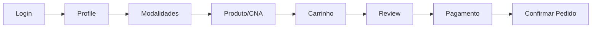

# Integração Rede Âncora B2B — Carrinho e Pedido

Guia de implementação passo a passo, da consulta de cadastros até a confirmação do pedido.

**Documentação oficial:** [Swagger API](https://app.redeancora.com.br/b2b/api/docs/api/integration) · [Manual Técnico Confluence](https://redeancora.atlassian.net/wiki/spaces/ADSP/pages/195887105)

| Item | Valor |
|------|-------|
| Base URL (produção) | `https://app.redeancora.com.br/b2b` |
| Base URL (staging) | `https://app.stg.redeancora.com.br/b2b` |
| Prefixo de endpoints (código) | `/api/api/integration/v1` |
| Prefixo documentação Swagger | `/api/integration/v1` |
| Versão | 1.0.0 |
| Autenticação (produção) | Header `X-API-KEY` apenas |
| Autenticação (dev/Swagger) | JWT Bearer opcional para `/auth/login`, `/auth/me`, `/auth/refresh` |
| Swagger | [`/b2b/api/docs/api/integration`](https://app.redeancora.com.br/b2b/api/docs/api/integration) |

---

## Headers padrão

**Produção (integrador ERP):** somente `X-API-KEY`:

```http
X-API-KEY: {sua_chave_api}
Content-Type: application/json
Accept: application/json
```

**Desenvolvimento local (Swagger):** endpoints `/auth/*` podem usar JWT Bearer adicional:

```http
Authorization: Bearer {access_token}
X-API-KEY: {sua_chave_api}
Content-Type: application/json
Accept: application/json
```

> A chave `X-API-KEY` é fornecida ao franqueado pela Rede Âncora e gravada em `Integracao.RedeAncoraAutenticacao.ChaveApi` via `UsuarioService.SalvarChaveApiRedeAncora`.

---

## Carrinho compartilhado (regra de produto)

O checkout da API é por **cliente/chave (franqueado)** — o header `X-API-KEY` — **não** por usuário Data7.

| Implicação | Detalhe |
|------------|---------|
| Um `cart_id` por chave | Vários operadores ERP com a mesma `X-API-KEY` veem e alteram o **mesmo** carrinho |
| `IdCarrinhoAtual` | Cache local em `RedeAncoraEmpresa` por `CodUsuario` de integração — **não** prova de carrinho exclusivo por usuário na API |
| Cabeçalho `Integracao.RedeAncoraCarrinho` | **Não** tem `CodUsuario` |
| `CodUsuario` no **item** | Auditoria (quem lançou no ERP) — **não** dono do cart na API |

**Proibido** em produção e em homologação compartilhada (mesma chave que a loja):

- `DELETE /checkout/{cartId}` — wipe da loja (todos os itens de todos os operadores).
- “Esvaziar o carrinho” ou apagar itens de outros operadores sem confirmação multi-usuário.

Remover na API: só `item_id` da sessão / próprios (`DELETE .../items/{itemId}` ou `POST .../bulk/items/delete` com a lista da sessão).

Harness: `DefinirDeletarCarrinhoAoFinal` **não** é `DeletarCarrinho`. Padrão `False`. Nunca wipe do cart no bootstrap. Limpeza de reorder (`DefinirTestarReorder`) também pode afetar itens pré-existentes no mesmo cart. Ver [Limpeza do carrinho em produção](#limpeza-do-carrinho-em-produção).

---

## Classificação oficial dos endpoints

> Baseado em [API B2B - Endpoints Essenciais e Recomendados](https://redeancora.atlassian.net/wiki/spaces/ADSP/pages/408780804) — ERPs homologados **devem** implementar os essenciais.

| Classificação | Descrição |
|---|---|
| **Essencial** | Obrigatório para ERPs homologados |
| **Recomendado** | Permite fechar pedido completo via API sem intervenção no portal web |
| **Opcional** | Complementar (garantia, histórico, boletos, NFe…) |

## Ordem de implementação (visão geral)

```
Fase 1  → Conectividade e autenticação          [Recomendado: ping; Essencial: login]
Fase 2  → Cadastro do franqueado                [Essencial: profile]
Fase 3  → Modalidades e catálogo de apoio       [Essencial: modalities]
Fase 4  → Consulta de produto                   [Essencial: full-search / bulk-search / prices-stocks]
Fase 5  → Carrinho (criar, adicionar, atualizar, remover) [Essencial]
Fase 6  → Checkout (revisão, pagamento, logística)  [Recomendado]
Fase 7  → Confirmar pedido                      [Recomendado]
```



---

## Status de implementação no projeto `redeancora_compra`

> Atualizado conforme o código em `src/application/services/rede_ancora/` e facade `UsuarioService`.  
> A especificação dos endpoints abaixo permanece válida; esta seção indica **o que já está codificado**.

| Fase | Status | Service(s) | Facade (`UsuarioService`) |
|------|--------|------------|---------------------------|
| 1 — Auth | ✅ | `rede_ancora_autenticacao_service` | `PingRedeAncora`, `SalvarChaveApiRedeAncora`, `SincronizarRedeAncoraUsuarioApi`, `InicializarRedeAncora` (+ catálogo). JWT/login **não** implementado (produção usa só `X-API-KEY`) |
| 2 — Profile | ✅ | `rede_ancora_empresa_service` | `SincronizarRedeAncoraPerfil`, `ValidarRedeAncoraPodeOperar`, `ListarRedeAncoraCentrosDistribuicao` |
| 3 — Modalidades / catálogo | ✅ | `rede_ancora_modalidade_service`, `rede_ancora_catalogo_service` | `SincronizarRedeAncoraModalidades`, `SincronizarRedeAncoraCatalogo`, `ListarRedeAncoraMarcas/Linhas/Familias` |
| 4 — Produtos | ✅ | `rede_ancora_produto_service` | `ConsultarRedeAncoraProdutoCondicoes`, `ConsultarRedeAncoraProdutoPrecosEstoques`, `BuscarRedeAncoraProdutoFullSearch`, `BuscarRedeAncoraProdutoBulkSearch`, `ConsultarRedeAncoraProdutoCentrosComEstoque`, `BuscarRedeAncoraProdutos`, `ConsultarRedeAncoraProdutoSimilares`, `BuscarRedeAncoraProdutosPorLote`, `ConsultarRedeAncoraProdutoPrecosEstoquesTodosCds` + cadastro/vínculo CNA |
| 5 — Carrinho | ✅ | `rede_ancora_carrinho_service` | `AbrirRedeAncoraCarrinho`, `AdicionarItensRedeAncoraCarrinho`, `AtualizarItem*`, `RemoverItem*`, `DeletarRedeAncoraCarrinho`, `ReordenarRedeAncoraCarrinho` |
| 6 — Checkout | ✅ | `rede_ancora_checkout_service` | `RevisarRedeAncoraCarrinho`, `ConsultarRedeAncoraPagamentos`, `AplicarRedeAncoraCondicaoPagamento`, `ListarRedeAncoraTransportadores`, `ConsultarRedeAncoraEntregasLogistica`, `ConsultarRedeAncoraTransportador`, `CriarRedeAncoraTransportador`, `AtualizarRedeAncoraTransportador`, `ExcluirRedeAncoraTransportador`, `ListarRedeAncoraTiposVeiculo` |
| 7 — Pedido | ✅ | `rede_ancora_checkout_service` | `ConfirmarRedeAncoraPedido`, `ListarRedeAncoraPedidosLocal` |
| 8 — Sales (API) | ✅ | `rede_ancora_sales_service` | `ListarRedeAncoraPedidosApi`, `ConsultarRedeAncoraPedidoApi`, `ListarRedeAncoraItensPedidoApi`, `ConsultarRedeAncoraItemPedidoApi`, `CancelarRedeAncoraPedidoApi`, `ListarRedeAncoraPendenciasApi`, `ListarRedeAncoraPendenciasPorPedidoApi` — pass-through JSON |
| 9 — ScheduledOrder | ✅ | `rede_ancora_pedido_programado_service` | `ListarRedeAncoraPedidosProgramados`, `ConsultarRedeAncoraPedidoProgramado`, `ConsultarRedeAncoraResumoPedidoProgramado`, `ListarRedeAncoraProdutosPedidoProgramado`, `SolicitarRedeAncoraRelatorioProdutosPedidoProgramado` — pass-through JSON |
| 10 — Agenda de compras | ✅ | `rede_ancora_agenda_compras_service` | `ListarRedeAncoraOfertasAgenda` — pass-through JSON |

### Persistência local (`Integracao`)

| Tabela | Preenchimento |
|--------|----------------|
| `RedeAncoraAutenticacao` | **Manual** — `ChaveApi` por `CodUsuario` (`SalvarChaveApiRedeAncora`); demais campos preenchidos via `GET /profile` |
| `RedeAncoraEmpresa`, `RedeAncoraCentroDistribuicao` | Automático via `GET /profile` |
| `RedeAncoraModalidade`, marcas/linhas/famílias | Automático via sync de modalidades e catálogo |
| `RedeAncoraProdutoVinculo` | Cadastro Âncora (PK `Cna`); `CodProduto` opcional (vínculo ERP) |
| `RedeAncoraProdutoImagem` | URLs de imagem por `Cna` (PK `Cna + Item + TipoImagem`); sync via `bulk-search` / `full-search` |
| `RedeAncoraCarrinho`, `RedeAncoraCarrinhoItem` | Automático a cada operação de carrinho (cabeçalho + itens na mesma transação) |
| `RedeAncoraPedido` | Automático após `POST .../order` |

#### Esquema local do carrinho

O vínculo com o carrinho ativo da API:

```
RedeAncoraEmpresa.IdCarrinhoAtual  →  RedeAncoraCarrinho.IdCarrinho (UUID)
RedeAncoraCarrinho.CodCarrinho     →  RedeAncoraCarrinhoItem.CodCarrinho
```

`IdCarrinhoAtual` é **cache local** por `CodUsuario` de integração. O `cart_id` na API é da chave/franqueado (compartilhado). Ver [Carrinho compartilhado](#carrinho-compartilhado-regra-de-produto).

| Tabela | PK | Colunas principais |
|--------|-----|-------------------|
| `RedeAncoraCarrinho` | `CodCarrinho` | `IdCarrinho`, `Convertido`, `Canal`, `QtdItens`, `QtdItensTotal`, `Subtotal`, `Impostos`, `Total`, `DataAtualizacao` |
| `RedeAncoraCarrinhoItem` | `CodCarrinho`, `Item` | `IdItemApi`, `Cna`, `CodCentroDistribuicao`, `CodCondicaoPagamento`, `DescricaoCondicaoPagamento`, `CodProduto`, `CodigoReferenciaFabricante`, `Descricao`, `CodModalidade`, `Quantidade`, `PrecoUnitario`, `ImpostoUnitario`, **`CodUsuario`**, **`NomeUsuario`**, **`DataLancamento`**, **`HoraLancamento`**, **`EstacaoTrabalho`** |

`Item` é gerado localmente (sequencial `00001`, `00002`, … pela ordem do array `items` da API). Operações na API usam `item_id` (`IdItemApi`).

Mapeamento JSON → coluna (item):

| Coluna local | Campo API |
|--------------|-----------|
| `IdItemApi` | `item_id` |
| `Cna` | `cna` |
| `CodCentroDistribuicao` | `seller.seller_id` |
| `CodCondicaoPagamento` | `cond_pag` |
| `DescricaoCondicaoPagamento` | `cond_pag_label` |
| `CodigoReferenciaFabricante` | `code` |
| `Descricao` | `description` |
| `CodModalidade` | `modality` |
| `Quantidade` | `qty` |
| `PrecoUnitario` | `unit_price` |
| `ImpostoUnitario` | `unit_taxes` |
| `CodProduto` | solicitacao local ou `RedeAncoraProdutoVinculo` (não vem da API) |

#### Auditoria local de lançamento (ERP)

Colunas preenchidas **somente** quando o item é incluído via `POST /checkout/items` (`AdicionarItens`) por um usuário logado no ERP. Não vêm da API.

| Coluna | Tipo | Origem |
|--------|------|--------|
| `CodUsuario` | `INTEGER NOT NULL` | `UsuarioModel.UserId` (`GetLoggedUsuario`); `0` = sem lançamento ERP |
| `NomeUsuario` | `VARCHAR(30) NOT NULL` | Nome legível do usuário ERP (máx. 30 chars); vazio = sem lançamento |
| `DataLancamento` | `DATE NOT NULL` | Data do lançamento; `1900-01-01` = sem lançamento |
| `HoraLancamento` | `VARCHAR(8) NOT NULL` | Hora `HH:MM:SS`; vazio = sem lançamento |
| `EstacaoTrabalho` | `VARCHAR(50) NOT NULL` | `SessaoConexao.EstacaoTrabalho`; vazio = sem lançamento |

Regras:

- Gravação automática em `RedeAncoraCarrinhoService.ProcessarRespostaCarrinho` quando `pItensSolicitacao` está presente (`AdicionarItens`).
- Só itens com **`IdItemApi` novo** (ausente no snapshot local anterior) recebem auditoria.
- Sync posterior (`GET /checkout`, `PATCH`, pagamentos) **preserva** auditoria existente por `IdItemApi`.
- Itens do portal/reorder sem lançamento ERP ficam com defaults no banco (`CodUsuario=0`, strings vazias, `DataLancamento=1900-01-01`); em memória use `PossuiAuditoriaLancamento()` (`CodUsuario > 0`).
- `CodUsuario` no item é **quem lançou** no ERP — não identifica dono do cart na API (o cart é da chave).
- Colunas nullable da API (`CodCentroDistribuicao`, `CodProduto`, `PrecoUnitario`, etc.) continuam com `0`/`""` → `NULL` na gravação (`SqlCampoInteiroOuNull`, `SqlCampoTextoOuNull`, `SqlCampoDecimalOuNull`).

### Pendências de produto (fora da API)

| Item | Status |
|------|--------|
| Tela/UI de compra no ERP | ⏳ não implementada (`Principal.bas` só executa migrations; testes via `rede_ancora_dev_harness`) |
| Log dedicado de request/response para homologação | ✅ `RedeAncoraApiClient` + `mod_logger` (nível HTTP; corpos truncados em 2000 chars) |
| Retry automático em 404/429 de carrinho | ✅ 404 carrinho com fallback `GET /checkout`; 429/500 no `api_client` |
| Validar produto antes de cada `POST .../items` | ✅ `ValidarProdutoParaCarrinho` (desligável via config) |

---

## Fase 1 — Conectividade e autenticação

### Passo 1.1 — Verificar se a API está online `[Recomendado]`

**Endpoint:** `GET /api/integration/v1/ping`  
**Autenticação:** Não requer

```http
GET https://app.redeancora.com.br/b2b/api/integration/v1/ping
```

**Resposta esperada (200):**

```json
{
  "data": "PONG"
}
```

---

### Passo 1.2 — Login (obter JWT) `[Essencial]`

**Endpoint:** `POST /api/integration/v1/auth/login`  
**Autenticação:** Não requer (apenas neste passo)

```http
POST https://app.redeancora.com.br/b2b/api/integration/v1/auth/login
Content-Type: application/json

{
  "email": "usuario@empresa.com.br",
  "password": "SuaSenha"
}
```

**Resposta esperada (200):**

```json
{
  "access_token": "eyJ0eXAiOiJKV1QiLCJhbGciOiJIUzI1NiJ9...",
  "token_type": "bearer",
  "expires_in": 3600
}
```

**Persistir:** `access_token` e calcular expiração (`expires_in` = 3600 segundos).

---

### Passo 1.3 — Dados do usuário autenticado

**Endpoint:** `GET /api/integration/v1/auth/me`

```http
GET https://app.redeancora.com.br/b2b/api/integration/v1/auth/me
Authorization: Bearer {access_token}
X-API-KEY: {sua_chave_api}
```

**Resposta esperada (200):**

```json
{
  "id": 1,
  "name": "João Silva",
  "email": "usuario@empresa.com.br",
  "seller_id": 9,
  "created_at": "2020-01-15 10:30:00",
  "updated_at": "2024-06-01 14:20:00"
}
```

**Persistir:** `seller_id` como valor padrão de CD/seller.

---

### Passo 1.4 — Renovar token (antes de expirar)

**Endpoint:** `POST /api/integration/v1/auth/refresh`

```http
POST https://app.redeancora.com.br/b2b/api/integration/v1/auth/refresh
Authorization: Bearer {access_token}
X-API-KEY: {sua_chave_api}
```

**Resposta esperada (200):** mesmo formato do login (`access_token`, `token_type`, `expires_in`).

---

## Fase 2 — Cadastro do franqueado

> **Objetivo:** obter `estado`, `seller` (empresa/CD), verificar bloqueio e limite de crédito antes de qualquer operação de carrinho.

### Passo 2.1 — Profile completo do franqueado `[Essencial]`

**Endpoint:** `GET /api/integration/v1/profile`  
**Tag OpenAPI:** Cliente

```http
GET https://app.redeancora.com.br/b2b/api/integration/v1/profile
Authorization: Bearer {access_token}
X-API-KEY: {sua_chave_api}
```

**Resposta esperada (200) — estrutura resumida:**

```json
{
  "user": [
    {
      "id": 1,
      "email": "usuario@empresa.com.br",
      "name": "João Silva",
      "current_cart_id": "c3c46890-3cb9-46db-ad73-c6036ebe7bc1"
    }
  ],
  "company": [
    {
      "id": 789,
      "internal": 88,
      "nome": "Autopeças Exemplo LTDA",
      "apelido": "Autopeças Exemplo",
      "cgc": "12345678000199",
      "estado": 15,
      "warehouse_preferencial": 9,
      "endereco": {
        "logradouro": "Rua das Flores",
        "numero": 100,
        "bairro": "Centro",
        "cep": "29665-000",
        "uf": "ES"
      }
    }
  ],
  "warehouses": [
    {
      "nome": "Rede ANCORA - ES",
      "nome_fantasia": "ANCORA ES",
      "empresa": 9,
      "estado": 15,
      "preferential": 1
    },
    {
      "nome": "Rede ANCORA - MG",
      "nome_fantasia": "ANCORA MG",
      "empresa": 12,
      "estado": 11,
      "preferential": 0
    }
  ],
  "is_blocked": false,
  "blocked_reason": [],
  "balance": {
    "current_limit_value": 1000000.00,
    "total_limit_used": 250000.00,
    "current_balance": 750000.00,
    "orders_percent_limit_used": 25,
    "cart_value_limit_used": 0
  },
  "permissions": ["checkout", "orders"],
  "marketplace": false
}
```

**Campos críticos para o carrinho:**

| Campo | Uso |
|-------|-----|
| `company.id` / `company[0].id` | Gravado em `Integracao.RedeAncoraEmpresa.CodEmpresaAncora` |
| `company[0].estado` | ID do estado (ex.: `15`) — usado em buscas de produto |
| `company[0].warehouse_preferencial` | CD padrão (`empresa` = seller) |
| `warehouses[].empresa` | ID do seller/CD para `POST .../items` |
| `warehouses[].preferential` | `1` = CD preferencial |
| `user[0].current_cart_id` | Carrinho ativo da chave/franqueado (compartilhado; se existir) |
| `is_blocked` | Se `true`, interromper fluxo de compra |
| `balance.current_balance` | Saldo de crédito disponível |

**Validação obrigatória:**

```
SE is_blocked == true → exibir blocked_reason e não prosseguir
SE current_balance insuficiente → alertar antes de fechar pedido
```

---

## Fase 3 — Modalidades e catálogo de apoio

### Passo 3.1 — Listar modalidades de compra `[Essencial]`

**Endpoint:** `GET /api/integration/v1/modalities`

```http
GET https://app.redeancora.com.br/b2b/api/integration/v1/modalities
Authorization: Bearer {access_token}
X-API-KEY: {sua_chave_api}
```

**Resposta esperada (200):**

```json
{
  "data": [
    { "label": "Normal", "value": 1 },
    { "label": "Crossdocking", "value": 2 }
  ]
}
```

**Persistir:** mapa `value → label` para exibição e validação.

---

### Passo 3.2 — Listar marcas (opcional, para filtros de busca)

**Endpoint:** `GET /api/integration/v1/products/brands`

```http
GET https://app.redeancora.com.br/b2b/api/integration/v1/products/brands
Authorization: Bearer {access_token}
X-API-KEY: {sua_chave_api}
```

**Resposta esperada (200):**

```json
{
  "data": [
    {
      "id": 20,
      "name": "NAKATA",
      "catalog_code": 291,
      "erp_code": 37
    }
  ]
}
```

---

### Passo 3.3 — Listar linhas e famílias (opcional)

```http
GET /api/integration/v1/products/lines
GET /api/integration/v1/products/families
```

---

## Fase 4 — Consulta de produto (pré-requisito para adicionar ao carrinho)

> Para adicionar um item ao carrinho são obrigatórios: `cna`, `seller` (empresa) e `modality`.

> **Tipo do campo `cna`:** O CNA é tratado como **inteiro** nos payloads de carrinho (`POST /items`, `cna: 849766`) e como **string** nos endpoints de consulta de preço (`POST /prices-stocks`, `cnas: ["849766"]`). Respeite o tipo de cada endpoint para evitar erros de validação.

### Passo 4.1 — Condições completas do produto por CNA `[Essencial]`

**Endpoint:** `GET /api/integration/v1/products/conditions/{cna}`

Retorna preços, estoques, modalidades e condições de pagamento **agrupados por CD**.

```http
GET https://app.redeancora.com.br/b2b/api/integration/v1/products/conditions/849766
Authorization: Bearer {access_token}
X-API-KEY: {sua_chave_api}
```

**Uso:** decidir `seller` (empresa), `modality` e validar estoque antes de incluir no carrinho.

---

### Passo 4.2 — Preço e estoque no CD preferencial `[Essencial]`

**Endpoint:** `POST /api/integration/v1/products/prices-stocks`

```http
POST https://app.redeancora.com.br/b2b/api/integration/v1/products/prices-stocks
Authorization: Bearer {access_token}
X-API-KEY: {sua_chave_api}
Content-Type: application/json

{
  "empresa": 9,
  "cnas": ["849766", "880939"]
}
```

**Resposta esperada (200) — estrutura resumida:**

```json
{
  "data": [
    {
      "cna": "849766",
      "empresa": 9,
      "estado": 15,
      "qtd_disponivel": 4,
      "qtd_projetada": 4,
      "preco_tabela": 107.29,
      "st_tabela": 20.66,
      "preco_cross_docking": 101.93,
      "preco_compra_junto": 104.61
    }
  ]
}
```

---

### Passo 4.3 — Busca de produto por código ou CNA `[Essencial]`

**Endpoint:** `GET /api/integration/v1/products/full-search`  
**Parâmetro obrigatório:** `empresa` (seller)

```http
GET https://app.redeancora.com.br/b2b/api/integration/v1/products/full-search?empresa=9&cna=849766&fields=prices,stocks,details
Authorization: Bearer {access_token}
X-API-KEY: {sua_chave_api}
```

**Busca em massa:**

```http
POST https://app.redeancora.com.br/b2b/api/integration/v1/products/bulk-search
Authorization: Bearer {access_token}
X-API-KEY: {sua_chave_api}
Content-Type: application/json

{
  "empresa": 9,
  "estado": 15,
  "cnas": ["849766", "880939"],
  "page": 1,
  "page_size": 100
}
```

> **No projeto:** `RedeAncoraProdutoService.BuscarProdutoBulkSearch` → `UsuarioService.BuscarRedeAncoraProdutoBulkSearch`. O array `cnas` é enviado como **strings** (`["849766"]`), igual em `prices-stocks`.

---

### Passo 4.3.1 — Imagens de produto (URLs locais)

Não existe endpoint separado de imagem na API. As URLs vêm no JSON de `GET /products/full-search` e `POST /products/bulk-search`:

| Campo API | Tipo local (`TipoImagem`) |
|-----------|---------------------------|
| `imagemReal` | `REAL` |
| `imagemIlustrativa` | `ILUSTRATIVA` |
| `imagensTecnicas` | `TECNICA` (array, uma linha por URL) |

**Tabela local:** `Integracao.RedeAncoraProdutoImagem` — PK `(Cna, Item, TipoImagem)`; colunas `DataAtualizacao`, `Url`. Vínculo por **CNA** (sem `Id` da API).

**Sync automático:** durante `SincronizarRedeAncoraProdutos*` (após upsert de metadados, na mesma transação do chunk).

**Sync dedicado (lista de CNAs):** `UsuarioService.SincronizarRedeAncoraImagensProdutos(codCentro, codEstado, cnas, tamanhoChunk)` → `POST /products/bulk-search` em chunks.

**Consulta local:** `UsuarioService.ListarRedeAncoraImagensProduto(cna)`.

URLs placeholder (`.../default.png`) são ignoradas. Produto desativado remove linhas de imagem via `ExcluirPorCna`.

---

### Passo 4.4 — Outros CDs com estoque (opcional)

**Endpoint:** `POST /api/integration/v1/products/warehouses/{cna}`

```http
POST https://app.redeancora.com.br/b2b/api/integration/v1/products/warehouses/849766
Authorization: Bearer {access_token}
X-API-KEY: {sua_chave_api}
Content-Type: application/json

{
  "estado": 15,
  "empresa": 9
}
```

> **No projeto:** `RedeAncoraProdutoService.ConsultarCentrosComEstoque` → `UsuarioService.ConsultarRedeAncoraProdutoCentrosComEstoque`.

### Passo 4.5 — Produtos complementares (opcional)

| Endpoint | Método service | Facade |
|----------|----------------|--------|
| `GET /products` | `BuscarProdutos` | `BuscarRedeAncoraProdutos` |
| `POST /products/similares` | `ConsultarSimilares` | `ConsultarRedeAncoraProdutoSimilares` |
| `POST /products/bulk` | `BuscarProdutosPorLote` | `BuscarRedeAncoraProdutosPorLote` |
| `POST /products/prices-stocks-warehouses` | `ConsultarPrecosEstoquesTodosCds` | `ConsultarRedeAncoraProdutoPrecosEstoquesTodosCds` |

> Retorno pass-through (`String` JSON bruto). `POST /products/bulk` exige ao menos uma lista: `cna_list`, `code_list` ou `gtin_list`.

---

## Fase 5 — Carrinho de compras

> O `cart_id` é da **chave/franqueado**, não do operador Data7. Ver [Carrinho compartilhado](#carrinho-compartilhado-regra-de-produto).

### Passo 5.1 — Criar ou recuperar carrinho

**Endpoint:** `GET /api/integration/v1/checkout`

Instancia um novo carrinho **ou** recupera o carrinho ativo do **franqueado** (mesma `X-API-KEY`). Vários operadores ERP com essa chave compartilham o mesmo `cart_id`.

```http
GET https://app.redeancora.com.br/b2b/api/integration/v1/checkout
Authorization: Bearer {access_token}
X-API-KEY: {sua_chave_api}
```

**Resposta esperada (200):**

```json
{
  "data": {
    "cart_id": "23fc1cc0-bf2d-4803-8233-0c6555be58b5",
    "converted": false,
    "items_count": 0,
    "items_qty_sum": 0,
    "items": [],
    "totals": {
      "subtotal": 0,
      "taxes": 0,
      "total": 0
    },
    "channel": "integracao"
  }
}
```

**Persistir:** `cart_id` (UUID).

> Se `profile.user[0].current_cart_id` existir e for válido, pode ser reutilizado. Em caso de 404, chamar este endpoint novamente.

---

### Passo 5.2 — Consultar carrinho específico `[Essencial]`

**Endpoint:** `GET /api/integration/v1/checkout/{cartId}`

```http
GET https://app.redeancora.com.br/b2b/api/integration/v1/checkout/23fc1cc0-bf2d-4803-8233-0c6555be58b5
Authorization: Bearer {access_token}
X-API-KEY: {sua_chave_api}
```

**Query params opcionais:**

| Param | Exemplo | Descrição |
|-------|---------|-----------|
| `brand_id` | `65\|41` | Filtro por marcas |
| `in_stock` | `0` | Filtro por estoque |
| `query` | `junta` | Busca na descrição/código |
| `aggregation` | `seller` | Agregar por: `review`, `user`, `seller`, `brand`, `modality` |

---

### Passo 5.3 — Adicionar itens ao carrinho `[Essencial]`

**Endpoint:** `POST /api/integration/v1/checkout/{cartId}/items`

```http
POST https://app.redeancora.com.br/b2b/api/integration/v1/checkout/23fc1cc0-bf2d-4803-8233-0c6555be58b5/items
Authorization: Bearer {access_token}
X-API-KEY: {sua_chave_api}
Content-Type: application/json

{
  "seller": 9,
  "modality": 1,
  "items": [
    { "cna": 849766, "qty": 2 },
    { "cna": 880939, "qty": 1 }
  ]
}
```

**Campos obrigatórios:**

| Campo | Origem |
|-------|--------|
| `seller` | `profile.warehouses[].empresa` ou `warehouse_preferencial` |
| `modality` | `GET /modalities` ou `GET /products/conditions/{cna}` |
| `items[].cna` | Busca de produto |
| `items[].qty` | Quantidade desejada |

**Regra:** se o produto já existir no carrinho para o mesmo `seller` + `modality`, a quantidade é **atualizada** (não duplica linha).

**Resposta esperada (200) — item retornado:**

```json
{
  "data": {
    "cart_id": "23fc1cc0-bf2d-4803-8233-0c6555be58b5",
    "items": [
      {
        "item_id": 4325,
        "cna": 849766,
        "code": "HG41045",
        "description": "AMORTECEDOR SUSPENSAO",
        "brand": "NAKATA",
        "brand_id": 20,
        "modality": 1,
        "qty": 2,
        "unit_price": 107.29,
        "unit_taxes": 20.66,
        "qty_available": 4,
        "seller": {
          "seller_id": 9,
          "name": "REDE ANCORA - ES",
          "region": 15
        },
        "cond_pag": 913,
        "cond_pag_label": "21/28/35"
      }
    ],
    "items_count": 1,
    "items_qty_sum": 2,
    "totals": {
      "subtotal": 214.58,
      "taxes": 41.32,
      "total": 255.90
    }
  }
}
```

**Persistir:** `item_id` de cada linha — usado em atualizações, remoções e checkout.

---

### Passo 5.4 — Atualizar quantidade ou modalidade de um item `[Essencial]`

**Endpoint:** `PATCH /api/integration/v1/checkout/{cartId}/items/{itemId}`

> Usar `item_id` do carrinho, **não** o CNA.

```http
PATCH https://app.redeancora.com.br/b2b/api/integration/v1/checkout/23fc1cc0-bf2d-4803-8233-0c6555be58b5/items/4325
Authorization: Bearer {access_token}
X-API-KEY: {sua_chave_api}
Content-Type: application/json

{
  "qty": 3,
  "modality": 2
}
```

**Atualização em lote:**

```http
PATCH https://app.redeancora.com.br/b2b/api/integration/v1/checkout/23fc1cc0-bf2d-4803-8233-0c6555be58b5/bulk/items
Authorization: Bearer {access_token}
X-API-KEY: {sua_chave_api}
Content-Type: application/json

{
  "items": [4325, 4326],
  "qty": 5,
  "modality": 1,
  "seller": 9
}
```

---

### Passo 5.5 — Remover itens `[Essencial]`

**Um item:**

```http
DELETE https://app.redeancora.com.br/b2b/api/integration/v1/checkout/23fc1cc0-bf2d-4803-8233-0c6555be58b5/items/4325
Authorization: Bearer {access_token}
X-API-KEY: {sua_chave_api}
```

**Vários itens:**

```http
POST https://app.redeancora.com.br/b2b/api/integration/v1/checkout/23fc1cc0-bf2d-4803-8233-0c6555be58b5/bulk/items/delete
Authorization: Bearer {access_token}
X-API-KEY: {sua_chave_api}
Content-Type: application/json

{
  "items": [4325, 4326, 4327]
}
```

> Remover só `item_id` da sessão / próprios. **Não** usar estas operações para “esvaziar o carrinho” em produção ou homologação compartilhada sem confirmação multi-usuário.

---

### Passo 5.6 — Deletar carrinho inteiro

**Endpoint:** `DELETE /api/integration/v1/checkout/{cartId}`

> **Proibido** em produção e em homologação compartilhada: wipe da loja (todos os itens de todos os operadores). Usar só em ambiente isolado (chave exclusiva). No ERP/harness, remover por `item_id` — nunca este endpoint.

```http
DELETE https://app.redeancora.com.br/b2b/api/integration/v1/checkout/23fc1cc0-bf2d-4803-8233-0c6555be58b5
Authorization: Bearer {access_token}
X-API-KEY: {sua_chave_api}
```

**Resposta esperada:** `204 No Content`

> Após deletar, chamar `GET /checkout` para criar um novo carrinho.

---

## Fase 6 — Checkout (revisão, pagamento e logística)

### Passo 6.1 — Revisão do carrinho `[Recomendado]`

**Endpoint:** `POST /api/integration/v1/checkout/{cartId}/review`

Retorna totais, itens por marca e **opções de entrega (carriers) por seller**.

```http
POST https://app.redeancora.com.br/b2b/api/integration/v1/checkout/23fc1cc0-bf2d-4803-8233-0c6555be58b5/review
Authorization: Bearer {access_token}
X-API-KEY: {sua_chave_api}
Content-Type: application/json

{
  "items": [4325, 4326]
}
```

> Omitir `items` para revisar todos os itens do carrinho.

**Resposta esperada (200) — estrutura resumida:**

```json
{
  "data": {
    "items_count": 2,
    "items_qty": 5,
    "totals": {
      "subtotal": 500.00,
      "taxes": 95.00,
      "total": 595.00
    },
    "items_by_brand": [
      {
        "brand": "NAKATA",
        "items_count": 2
      }
    ],
    "carriers": [
      {
        "seller_id": 9,
        "seller_name": "REDE ANCORA - ES",
        "carriers": [
          {
            "carrier_id": 2,
            "name": "Entrega Normal",
            "haulers_required": false
          },
          {
            "carrier_id": 5,
            "name": "Retirada com transportador",
            "haulers_required": true
          }
        ]
      }
    ]
  }
}
```

**Persistir:** `carrier_id` e `hauler_id` (se obrigatório) por `seller_id`.

---

### Passo 6.2 — Consultar formas de pagamento `[Recomendado]`

**Endpoint:** `POST /api/integration/v1/checkout/{cartId}/payments`

```http
POST https://app.redeancora.com.br/b2b/api/integration/v1/checkout/23fc1cc0-bf2d-4803-8233-0c6555be58b5/payments
Authorization: Bearer {access_token}
X-API-KEY: {sua_chave_api}
Content-Type: application/json

{
  "seller_id": 9,
  "modality": 1,
  "items": [4325, 4326]
}
```

**Resposta esperada (200):**

```json
{
  "data": {
    "vendor": [
      {
        "condition_handle": 913,
        "label": "21/28/35",
        "tag": "Especial"
      }
    ],
    "free": [
      {
        "condition_handle": 800,
        "label": "À vista",
        "tag": "Sem juros"
      }
    ],
    "special": []
  }
}
```

---

### Passo 6.3 — Aplicar condição de pagamento `[Recomendado]`

**Endpoint:** `PATCH /api/integration/v1/checkout/{cartId}/payments`

```http
PATCH https://app.redeancora.com.br/b2b/api/integration/v1/checkout/23fc1cc0-bf2d-4803-8233-0c6555be58b5/payments
Authorization: Bearer {access_token}
X-API-KEY: {sua_chave_api}
Content-Type: application/json

{
  "condition_handle": 913,
  "estado": 15,
  "items": [4325, 4326]
}
```

---

### Passo 6.4 — Detalhe da condição de pagamento (opcional)

**Endpoint:** `POST /api/integration/v1/checkout/{cartId}/payments/condition`

```http
POST https://app.redeancora.com.br/b2b/api/integration/v1/checkout/23fc1cc0-bf2d-4803-8233-0c6555be58b5/payments/condition
Authorization: Bearer {access_token}
X-API-KEY: {sua_chave_api}
Content-Type: application/json

{
  "seller_id": 9,
  "modality": 1,
  "condition": 913
}
```

> **No projeto:** `RedeAncoraCheckoutService.ConsultarDetalheCondicaoPagamento` → `UsuarioService.ConsultarRedeAncoraDetalheCondicaoPagamento`.

---

### Passo 6.5 — Logística: transportadores e formas de entrega

**Listar transportadores do usuário:**

```http
GET https://app.redeancora.com.br/b2b/api/integration/v1/logistics/haulers
Authorization: Bearer {access_token}
X-API-KEY: {sua_chave_api}
```

> **No projeto:** `RedeAncoraCheckoutService.ListarTransportadores` → `UsuarioService.ListarRedeAncoraTransportadores`.

**CRUD de transportadores (haulers):**

| Endpoint | Método service | Facade |
|----------|----------------|--------|
| `GET /logistics/haulers/{id}` | `ConsultarTransportador` | `ConsultarRedeAncoraTransportador` |
| `POST /logistics/haulers` | `CriarTransportador` | `CriarRedeAncoraTransportador` |
| `PATCH /logistics/haulers/{id}` | `AtualizarTransportador` | `AtualizarRedeAncoraTransportador` |
| `DELETE /logistics/haulers/{id}` | `ExcluirTransportador` | `ExcluirRedeAncoraTransportador` |
| `GET /logistics/haulers/vehicleTypes` | `ListarTiposVeiculo` | `ListarRedeAncoraTiposVeiculo` |

**Consultar carriers disponíveis:**

```http
POST https://app.redeancora.com.br/b2b/api/integration/v1/logistics/carriers
Authorization: Bearer {access_token}
X-API-KEY: {sua_chave_api}
Content-Type: application/json

{
  "cart_id": "23fc1cc0-bf2d-4803-8233-0c6555be58b5",
  "items": [4325, 4326]
}
```

> **No projeto:** `RedeAncoraCheckoutService.ConsultarEntregasLogistica` → `UsuarioService.ConsultarRedeAncoraEntregasLogistica`. Alternativa ao `POST .../review` para listar carriers.

---

## Fase 7 — Confirmar pedido (objetivo final)

### Passo 7.1 — Criar pedido a partir do carrinho `[Recomendado]`

**Endpoint:** `POST /api/integration/v1/checkout/{cartId}/order`

```http
POST https://app.redeancora.com.br/b2b/api/integration/v1/checkout/23fc1cc0-bf2d-4803-8233-0c6555be58b5/order
Authorization: Bearer {access_token}
X-API-KEY: {sua_chave_api}
Content-Type: application/json

{
  "carriers": [
    {
      "seller_id": 9,
      "carrier_id": 2,
      "hauler_id": null
    }
  ],
  "items": [4325, 4326]
}
```

**Campos:**

| Campo | Obrigatório | Descrição |
|-------|-------------|-----------|
| `carriers` | Sim | Um objeto por seller, obtido no `review` |
| `carriers[].seller_id` | Sim | ID do CD |
| `carriers[].carrier_id` | Sim | Forma de entrega (do `review`) |
| `carriers[].hauler_id` | Condicional | Obrigatório quando o carrier exige transportador |
| `items` | Não | IDs dos itens a fechar; omitir para fechar todos |

**Resposta esperada (200):**

```json
{
  "data": {
    "success": true,
    "message": "Sua compra gerou um pedido que será transmitido para a Rede ANCORA em alguns instantes.",
    "footer": "Você pode acompanhar seu(s) pedido(s) na página Meus Pedidos.",
    "orders": [
      {
        "id": 138453,
        "items": [
          {
            "id": 3945075,
            "cna": 849766,
            "code": 6267,
            "qty": 2,
            "unit_price": 107.29,
            "unit_taxes": 20.66
          }
        ]
      }
    ]
  }
}
```

**Persistir:** `orders[].id` — número do pedido no portal para acompanhamento.

> **No projeto:** `RedeAncoraCheckoutService.ConfirmarPedido` → `UsuarioService.ConfirmarRedeAncoraPedido`; persiste em `Integracao.RedeAncoraPedido` e marca o carrinho como convertido.

> A operação pode gerar **mais de um pedido** quando há itens de sellers, modalidades ou formas de pagamento diferentes.

---

## Sales — pedidos e pendências (pass-through)

Consultas à API de vendas sem persistência local adicional. Retorno JSON bruto (`String`).

| Endpoint | Método service | Facade |
|----------|----------------|--------|
| `GET /sales/orders` | `ListarPedidosApi` | `ListarRedeAncoraPedidosApi` |
| `GET /sales/orders/{orderId}` | `ConsultarPedidoApi` | `ConsultarRedeAncoraPedidoApi` |
| `GET /sales/orders/{orderId}/items` | `ListarItensPedidoApi` | `ListarRedeAncoraItensPedidoApi` |
| `GET /sales/orders/{orderId}/items/{itemId}` | `ConsultarItemPedidoApi` | `ConsultarRedeAncoraItemPedidoApi` |
| `GET /sales/orders/{orderId}/cancel` | `CancelarPedidoApi` | `CancelarRedeAncoraPedidoApi` |
| `POST /sales/orders/{orderId}/reorder` | `Reordenar` (carrinho) | `ReordenarRedeAncoraCarrinho` → `RedeAncoraCarrinhoModel` |
| `GET /sales/pendencies` | `ListarPendenciasApi` | `ListarRedeAncoraPendenciasApi` |
| `GET /sales/pendencies/by-orders` | `ListarPendenciasPorPedidoApi` | `ListarRedeAncoraPendenciasPorPedidoApi` |

---

## ScheduledOrder — pedidos programados (pass-through)

| Endpoint | Método service | Facade |
|----------|----------------|--------|
| `GET /scheduled-order` | `ListarPedidosProgramados` | `ListarRedeAncoraPedidosProgramados` |
| `GET /scheduled-order/{id}` | `ConsultarPedidoProgramado` | `ConsultarRedeAncoraPedidoProgramado` |
| `GET /scheduled-order/{id}/resume` | `ConsultarResumoPedidoProgramado` | `ConsultarRedeAncoraResumoPedidoProgramado` |
| `GET /scheduled-order/{id}/products` | `ListarProdutosPedidoProgramado` | `ListarRedeAncoraProdutosPedidoProgramado` |
| `GET /scheduled-order/{id}/products/report` | `SolicitarRelatorioProdutosPedidoProgramado` | `SolicitarRedeAncoraRelatorioProdutosPedidoProgramado` |

---

## Agenda de compras (pass-through)

| Endpoint | Método service | Facade |
|----------|----------------|--------|
| `GET /sale-offers/brands` | `ListarOfertasAgenda` | `ListarRedeAncoraOfertasAgenda` |

---

## Fluxo completo — exemplo sequencial

```
1.  GET  /ping                              → verificar API [Recomendado]
2.  POST /auth/login                        → obter token [Essencial]
3.  GET  /profile                           → estado=15, seller=9, verificar bloqueio [Essencial]
4.  GET  /modalities                        → Normal=1, Crossdocking=2 [Essencial]
5.  GET  /products/conditions/849766        → validar produto, preço e estoque [Essencial]
6.  GET  /checkout/{cartId}                 → obter/criar cart; usar current_cart_id do profile se disponível [Essencial]
7.  POST /checkout/{cartId}/items           → adicionar CNA 849766, qty=2 [Essencial]
8.  GET  /checkout/{cartId}                 → confirmar itens e item_ids [Essencial]
9.  POST /checkout/{cartId}/review          → obter carriers e totais [Recomendado]
    9a. SE carriers[].haulers_required == true:
        GET  /logistics/haulers             → listar transportadores do franqueado
        (usar hauler_id retornado no passo 12)
10. POST /checkout/{cartId}/payments        → listar formas de pagamento [Recomendado]
11. PATCH /checkout/{cartId}/payments       → aplicar condition_handle=913 [Recomendado]
12. POST /checkout/{cartId}/order           → confirmar pedido (com hauler_id se obrigatório) [Recomendado]
13. Salvar orders[].id no sistema local
```

> **Sobre o Passo 6 — `GET /checkout` vs `GET /checkout/{cartId}`:** O endpoint sem `cartId` (`GET /checkout`) cria ou recupera o carrinho ativo do **franqueado/chave** (compartilhado entre operadores com a mesma `X-API-KEY`). O endpoint com `cartId` consulta um carrinho específico. Para integração, recomenda-se verificar se `profile.user[0].current_cart_id` existe e está válido antes de chamar `GET /checkout`. Em caso de `404`, chame `GET /checkout` para obter um novo `cart_id`.

---

## Tratamento de erros

### Formato padrão das respostas de erro

A maioria dos erros retorna o seguinte envelope JSON:

```json
{
  "success": false,
  "message": "Descrição legível do erro.",
  "errors": ["campo_com_problema"]
}
```

> Em erros de validação de formulário (HTTP 422), o campo `errors` pode ser um **objeto** em vez de array:
> ```json
> { "message": "The given data was invalid.", "errors": { "email": ["The email field is required."] } }
> ```

> **Atenção — erros de negócio dentro do HTTP 200:** O bloqueio do franqueado (`is_blocked: true`) e saldo insuficiente são retornados como `200 OK` com campos no body. Tratá-los como estado de negócio, não como erro HTTP.

---

### Códigos HTTP globais

| HTTP | Causa | Ação |
|------|-------|------|
| 400 | Validação ou regra de negócio violada | Ler `message` + `errors`; corrigir dados |
| 401 | Token ausente, inválido ou expirado | Tentar `POST /auth/refresh`; se falhar, exigir novo login |
| 403 | Operação proibida (recurso de outro usuário/empresa) | Não retentar; logar e notificar |
| 404 | Recurso não encontrado (carrinho, item, CNA…) | Ver ação por endpoint na seção abaixo |
| 419 | CSRF token inválido (Laravel) | Incluir/renovar header `X-XSRF-TOKEN` |
| 422 | Dados semanticamente inválidos (falha de validação) | Ler `errors` e corrigir payload |
| 429 | Rate limit excedido | Backoff exponencial — ver seção Retry |
| 500 | Erro interno do servidor | Aguardar 30 s, retentar 1×; se persistir, contatar suporte |

---

### Erros por endpoint

#### Fase 1 — Autenticação

**`POST /auth/login`**

| Situação | HTTP | `message` | Ação |
|---|---|---|---|
| Email ou senha inválidos | 401 | `"Unauthorized."` | Verificar credenciais |
| Campos obrigatórios ausentes | 422 | `"The given data was invalid."` | Incluir `email` e `password` |
| API fora do ar | 500 | — | Aguardar e retentar |

**`GET /auth/me`**

| Situação | HTTP | Ação |
|---|---|---|
| Token expirado | 401 | Chamar `POST /auth/refresh` |
| Token ausente | 401 | Incluir header `Authorization: Bearer {token}` |

**`POST /auth/refresh`**

| Situação | HTTP | Ação |
|---|---|---|
| Token revogado ou expirado | 401 | Token não renovável — exigir novo login completo |

---

#### Fase 2 — Profile

**`GET /profile`**

| Situação | HTTP / campo | Ação |
|---|---|---|
| Token inválido | 401 | Renovar token |
| Franqueado bloqueado | **200** + `is_blocked: true` | Exibir `blocked_reason[]` e interromper fluxo de compra |
| Saldo insuficiente | **200** + `balance.current_balance` baixo | Alertar o usuário antes de fechar pedido |

---

#### Fase 5 — Carrinho

**`GET /checkout` e `GET /checkout/{cartId}`**

| Situação | HTTP | Ação |
|---|---|---|
| `cart_id` expirado ou já convertido em pedido | 404 | Chamar `GET /checkout` (sem `cartId`) para criar novo |
| Token inválido | 401 | Renovar token |

**`POST /checkout/{cartId}/items`**

| Situação | HTTP | `errors` | Ação |
|---|---|---|---|
| Modalidade indisponível para o produto | 400 | `["modality"]` | Consultar `GET /products/conditions/{cna}` para modalidades válidas |
| Estoque insuficiente | 400 | `["qty"]` | Reduzir `qty` ou consultar outro CD |
| `seller` inválido ou sem acesso | 400 | `["seller"]` | Verificar `profile.warehouses` |
| `cna` não encontrado no CD | 404 | — | Verificar CNA e campo `empresa` |
| Carrinho não encontrado | 404 | — | Recriar com `GET /checkout` |
| Carrinho já convertido em pedido | 400 | `["cart"]` | Recriar com `GET /checkout` |

**`PATCH /checkout/{cartId}/items/{itemId}`**

| Situação | HTTP | Ação |
|---|---|---|
| `item_id` não pertence ao carrinho | 404 | Refazer `GET /checkout/{cartId}` para atualizar `item_id`s |
| `qty` zero ou negativo | 400 | Usar `DELETE` em vez de PATCH para remover o item |
| Carrinho não encontrado | 404 | Recriar com `GET /checkout` |

**`PATCH /checkout/{cartId}/bulk/items`**

| Situação | HTTP | Ação |
|---|---|---|
| Array `items` vazio | 400 | Incluir ao menos um `item_id` |
| Um ou mais `item_id`s inválidos | 404 | Refazer `GET /checkout/{cartId}` para atualizar ids |

**`DELETE /checkout/{cartId}/items/{itemId}`**

| Situação | HTTP | Ação |
|---|---|---|
| Item já removido | 404 | Ignorar — operação idempotente |
| Carrinho não encontrado | 404 | Recriar com `GET /checkout` |

**`POST /checkout/{cartId}/bulk/items/delete`**

| Situação | HTTP | Ação |
|---|---|---|
| Array `items` vazio | 400 | Incluir ao menos um `item_id` |
| Carrinho não encontrado | 404 | Recriar com `GET /checkout` |

**`DELETE /checkout/{cartId}`**

> **Proibido** em produção / homologação compartilhada (wipe da loja). Ver [Carrinho compartilhado](#carrinho-compartilhado-regra-de-produto).

| Situação | HTTP | Ação |
|---|---|---|
| Carrinho não encontrado | 404 | Ignorar — já deletado |
| Carrinho já convertido em pedido | 400 | Não é possível deletar pedido fechado |

---

#### Fase 6 — Checkout

**`POST /checkout/{cartId}/review`**

| Situação | HTTP | Ação |
|---|---|---|
| Carrinho vazio (sem itens) | 400 | Adicionar itens antes de revisar |
| Carrinho não encontrado | 404 | Recriar com `GET /checkout` |

**`POST /checkout/{cartId}/payments`**

| Situação | HTTP | Ação |
|---|---|---|
| `seller_id` sem condições de pagamento para os itens | 400 | Verificar seller e modalidade dos itens |
| `item_id`s não pertencem ao carrinho | 400 | Refazer `GET /checkout/{cartId}` |

**`PATCH /checkout/{cartId}/payments`**

| Situação | HTTP | `errors` | Ação |
|---|---|---|---|
| `condition_handle` inválida | 400 | `["condition_handle"]` | Consultar `POST /payments` para listar condições válidas |
| `estado` inválido | 400 | `["estado"]` | Usar `company[0].estado` do profile |

---

#### Fase 7 — Pedido

**`POST /checkout/{cartId}/order`**

| Situação | HTTP | Ação |
|---|---|---|
| `hauler_id` obrigatório mas ausente | 400 | Consultar `GET /logistics/haulers`; incluir `hauler_id` |
| Pagamento não definido para os itens | 400 | Executar `PATCH /payments` antes de confirmar |
| Saldo de crédito insuficiente | 400 | Verificar `profile.balance.current_balance` antes |
| Franqueado bloqueado | 400 | Verificar `profile.is_blocked` antes |
| Carrinho vazio ou já convertido | 400 | Verificar estado com `GET /checkout/{cartId}` |
| `carrier_id` inválido para o seller | 400 | Consultar `POST /review` para carriers disponíveis |

---

### Estratégia de retry

```
401  -> 1. Tentar POST /auth/refresh
        2. Se refresh retornar 401: exigir novo login (nao retentar mais)

404 (carrinho)
     -> Criar novo carrinho: GET /checkout
        Nao retentar com o mesmo cart_id

429  -> Backoff exponencial:
          Tentativa 1: aguardar 60 s
          Tentativa 2: aguardar 120 s
          Tentativa 3: aguardar 300 s (5 min)
        Desistir apos 3 tentativas; notificar operador

500  -> Aguardar 30 s, retentar 1x
        Se persistir: logar corpo da resposta e contatar suporte Rede ANCORA

400 / 422
     -> NAO retentar automaticamente
        Corrigir dados ou regra de negocio; acao manual necessaria
```

---

## Checklist de implementação

Legenda: `[x]` feito no código · `[ ]` pendente ou parcial

### Infraestrutura
- [x] Cliente HTTP com `X-API-KEY` (`rede_ancora_http_client`, `rede_ancora_api_client`)
- [x] HTTP 401 → exige chave API válida (sem refresh JWT em produção)
- [x] Retry 429 (backoff 60/120/300s) e 500 (30s, 1x) no `RedeAncoraApiClient`
- [x] Log HTTP request/response com corpos truncados (`DefinirRedeAncoraLogHttp`)
- [x] Testes manuais via bootstraps (`rede_ancora_dev_harness`, smoke, empresa, produto, checkout)

### Cadastros (Fase 2–4)
- [x] `GET /profile` na inicialização (`InicializarRedeAncora` / `SincronizarRedeAncoraPerfil`)
- [x] Validar `is_blocked` antes de operar (`ValidarRedeAncoraPodeOperar`)
- [x] Cache de `estado`, seller padrão e CDs (`RedeAncoraEmpresa`, `RedeAncoraCentroDistribuicao`)
- [x] `GET /modalities` em cache (`RedeAncoraModalidade`)
- [x] `GET /products/brands`, `/lines`, `/families` em cache
- [x] `GET /products/conditions/{cna}`
- [x] `POST /products/prices-stocks` (cnas como strings)
- [x] `GET /products/full-search`
- [x] `POST /products/bulk-search`
- [x] `POST /products/warehouses/{cna}`
- [x] `GET /products`, `POST /products/similares`, `POST /products/bulk`, `POST /products/prices-stocks-warehouses`
- [x] Cadastro local de produtos Âncora e vínculo ERP (`RedeAncoraProdutoVinculo`, PK `Cna`)
- [x] Imagens de produto por CNA (`RedeAncoraProdutoImagem`; sync automático + `SincronizarRedeAncoraImagensProdutos`)
- [x] Consulta de produto obrigatória antes de cada inclusão no carrinho (`ValidarProdutoParaCarrinho`)

### Carrinho (Fase 5)
- [x] `GET /checkout` — criar/recuperar
- [x] `GET /checkout/{cartId}` (+ filtros opcionais: `brand_id`, `in_stock`, `query`, `aggregation`)
- [x] `POST .../items` — adicionar com seller + modality + cna
- [x] `PATCH .../items/{itemId}` — atualizar qty/modality
- [x] `PATCH .../bulk/items` e `POST .../bulk/items/delete`
- [x] `DELETE` item e carrinho inteiro
- [x] Persistir `cart_id` e `item_id` (`RedeAncoraCarrinho`, `RedeAncoraCarrinhoItem`) em transação única

### Checkout e pedido (Fase 6–7)
- [x] `POST .../review` — carriers por seller
- [x] `GET /logistics/haulers` — transportadores
- [x] CRUD `/logistics/haulers` e `GET /logistics/haulers/vehicleTypes`
- [x] `POST /logistics/carriers` — consulta alternativa de entregas
- [x] `POST` + `PATCH .../payments` — listar e aplicar condição de pagamento
- [x] `POST .../payments/condition` — detalhe da condição
- [x] `POST .../order` — confirmar pedido (com `hauler_id` quando exigido)
- [x] Persistir `orders[].id` (`RedeAncoraPedido`)
- [x] Tratar múltiplos pedidos na mesma operação (lista em `RedeAncoraPedidosModel`)
- [x] Sales: listar/consultar/cancelar pedidos e pendências; reorder → carrinho
- [x] ScheduledOrder: listar/consultar pedidos programados e produtos
- [x] Agenda de compras: `GET /sale-offers/brands`
- [ ] Tela ou fluxo ERP ponta a ponta (UI)

---

## Homologação manual (dev harness)

O plugin em produção executa apenas migrations (`AppBoot.Run()` em `Principal.bas`). Testes contra a API real usam [`rede_ancora_dev_harness`](../src/application/bootstrap/rede_ancora_dev_harness.bas).

### Pré-requisitos

1. Gravar `ChaveApi` para o `CodUsuario` (`SalvarChaveApiRedeAncora`) ou passar via `DefinirChaveApi` no harness (não commitar chave no repositório).
2. Recompilar o projeto (`Ctrl+Shift+B`).
3. Descomentar o bloco de exemplo em `Principal.bas` ou invocar o harness de outro ponto de teste.

### Roteiro recomendado

| Ordem | Cenário harness | O que valida |
|-------|-----------------|--------------|
| 1 | `CenarioSmoke()` | Ping + profile básico |
| 2 | `CenarioEmpresa()` | `GET /profile` → tabelas `RedeAncoraEmpresa` e CDs |
| 3 | `CenarioProduto()` | Sync CNA → `RedeAncoraProdutoVinculo` |
| 4 | `CenarioCheckout()` | Carrinho + review + payments (sem `POST /order` por padrão) |
| 5 | `CenarioNovos()` | Sales, ScheduledOrder, Agenda, Haulers (leitura) + produtos complementares novos |
| 6 | `CenarioCompleto()` | Sequência 1→5 |

Para catálogo completo no passo 3: `DefinirBaixarCatalogoCompleto(True)` no harness (via `ExecutarProduto` interno).

Para fechar pedido real: staging + `DefinirConfirmarPedido(True)` no harness (incompatível com `DefinirDeletarCarrinhoAoFinal(True)`).

Para testar apenas os endpoints novos (Sales, ScheduledOrder, Agenda, Haulers leitura): `DefinirCenario(RedeAncoraDevHarness.CenarioNovos())`.

Opcional no bootstrap `rede_ancora_api_novos_bootstrap`: `DefinirTestarHaulersCrud(True)` (cria/atualiza/exclui transportador de teste) e `DefinirTestarReorder(True)` (reorder + limpeza dos itens do carrinho gerado). **Não** testa `CancelarPedidoApi` (destrutivo). A limpeza de reorder age no **mesmo** cart compartilhado e **pode** afetar itens pré-existentes.

### Limpeza do carrinho em produção

O `cart_id` é da chave/franqueado — ver [Carrinho compartilhado](#carrinho-compartilhado-regra-de-produto). `DefinirDeletarCarrinhoAoFinal` **não** é `DeletarCarrinho` (`DELETE /checkout/{cartId}`). Padrão **`False`**. O bootstrap **nunca** faz wipe do cart.

O `rede_ancora_checkout_bootstrap` usa por padrão `ConfirmarPedido=False` e **`DeletarCarrinhoAoFinal=False`** (seguro em ambiente compartilhado):

1. **Antes do teste:** **não** remove carrinho pré-existente (`IdCarrinhoAtual` do profile permanece intacto). **Nunca** wipe no bootstrap.
2. **Durante o teste:** registra `cart_id` da sessão e diff de `item_id`s antes/depois do `POST /checkout/items`.
3. **Ao final (passo 13, só se `DefinirDeletarCarrinhoAoFinal(True)`):** `POST /checkout/{cartId}/bulk/items/delete` com **apenas** os `item_id`s adicionados nesta sessão — **nunca** `DELETE /checkout/{cartId}` inteiro.
4. **Em caso de erro:** mesma limpeza parcial (itens de teste), se `cart_id` da sessão ainda coincidir.

Nunca usar `ConfirmarPedido=True` com `DeletarCarrinhoAoFinal=True` em produção — o bootstrap bloqueia essa combinação.

Para limpeza automática em ambiente de teste isolado (API key exclusiva): `DefinirDeletarCarrinhoAoFinal(True)` — remove só `item_id`s da sessão, não o cart.

### Checklist pós-deploy

| Verificação | Esperado |
|-------------|----------|
| Sync produto existente | `CodProduto` manual **não** sobrescrito (`AtualizarMetadadosApi`) |
| Adicionar ao carrinho | Sem Access violation no mapeamento JSON |
| Review + payments | Totais e `item_id` corretos nos logs |
| Carrinho de teste | Itens desta sessão removidos no passo 13 **somente** com `DefinirDeletarCarrinhoAoFinal(True)`; carrinho pré-existente **não** é apagado |
| Produção sem sujeira | `DeletarCarrinhoAoFinal=False` (padrão); `ConfirmarPedido=False`; **nunca** `DELETE /checkout/{cartId}` |
| `Principal.bas` em produção | Só migrations, sem chamadas API automáticas |

### Ajustes finos comuns

- **CNA sem estoque:** usar `DefinirCna` com CNA conhecido ou consultar `prices-stocks` antes do carrinho.
- **Carrier com transportador obrigatório:** harness lista `GET /logistics/haulers` e preenche `CodTransportador`.
- **Contagens zeradas no review:** conferir chaves `items_qty` (review) vs `items_qty_sum` (carrinho) — endpoints distintos.

---

## Referências

- [Documentação Swagger (OpenAPI)](https://app.redeancora.com.br/b2b/api/docs/api/integration)
- [Manual Técnico — Confluence](https://redeancora.atlassian.net/wiki/spaces/ADSP/pages/195887105)
- [Endpoints Essenciais e Recomendados — Confluence](https://redeancora.atlassian.net/wiki/spaces/ADSP/pages/408780804)
- Base URL produção: `https://app.redeancora.com.br/b2b`
- Base URL staging: `https://app.stg.redeancora.com.br/b2b`
- Prefixo dos endpoints no código: `/api/api/integration/v1/`
- Prefixo na documentação Swagger: `/api/integration/v1/`
